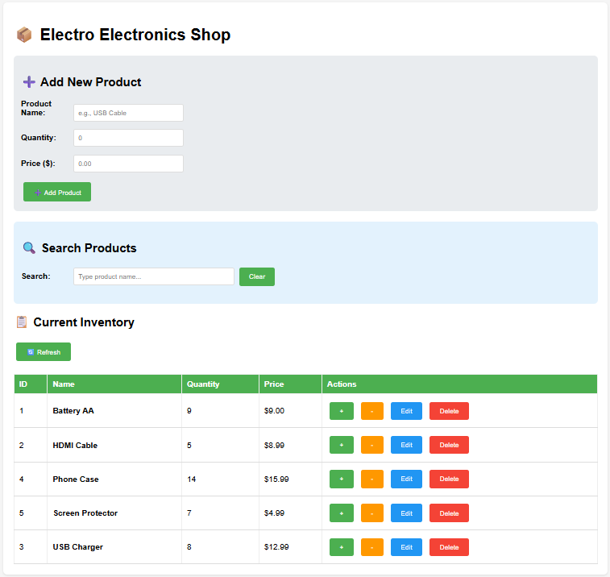

A Basic Inventory Management App

In this project, I have created a very basic full-featured inventory management system built with Python/Flask backend and vanilla HTML/CSS/JavaScript frontend. Perfect for small retail shops.

## 🎯 Features

### ✅ Current Features

**Product Management**
- Add new products with name, quantity, and price
- Edit product names and prices
- Delete products
- View all products in a clean table format

**Stock Management**
- Increment/decrement stock by 1 with +/- buttons
- Automatic low stock detection (alerts when quantity < 5)
- Red highlighting for low stock items

**Search & Filter**
- Real-time search by product name
- Clear search button to reset view

**Data Persistence**
- SQLite database for reliable data storage
- Automatic database creation on first run
- Sample products included for testing

## 🛠️ Technology Stack

| Layer | Technology | Purpose |
|-------|------------|---------|
| Backend | Python 3 + Flask | REST API server |
| Database | SQLite3 | Lightweight local database |
| Frontend | HTML5/CSS3/JavaScript | User interface |
| HTTP Client | Fetch API | Frontend-backend communication |

## 📋 Prerequisites

- **Python 3.8 or higher** - [Download Python](https://www.python.org/downloads/)
- **pip** (comes with Python)
- **Git** (optional, for cloning)

## 🚀 Installation & Setup

### 1. Clone or Download the Repository

```bash
git clone https://github.com/yourusername/shop-inventory.git
cd shop-inventory
```

Or simply download the ZIP file and extract.

### 2. Install dependencies
```bash
pip install flask
```

### 3. Run the Application
```bash
python server.py
```
### 4. Open in Browser
Navigate to: http://localhost:3000


## 🔌 API Endpoints

| Method | Endpoint | Description |
|--------|----------|-------------|
| GET | `/` | Serves the HTML interface |
| GET | `/api/products` | Get all products |
| POST | `/api/products` | Add a new product |
| PUT | `/api/products/<id>` | Update product name/price |
| DELETE | `/api/products/<id>` | Delete a product |
| PATCH | `/api/products/<id>/stock` | Update stock quantity |

## Architecture Diagram
(HTML/CSS/JS)
      |
      | HTTP Requests
      v
Flask Server
(server.py)
      |
      | SQL Queries
      v
SQLite Database
(inventory.db)

## 📚 Understanding the Technologies Used

- **Python**: is the progamming language used to run the backend server, process requests from the web page, and talk to the database. Has excellent libraries for web development (Flask).
- **Flask**: is a "micro-framework" for Python that helps create web applications. In this project, Flask is used to create the web server, define what happens when someone visits different URLs (like `/api/products`), and handle requests from the frontend. It is perfect for small to medium applications.
- **SQLite**: the database used. Advantage is that no separate database server is needed.
- **HTML, CSS**: HTML defines what content appears on the web page. CSS is used for the styling and design of web pages, to make things look good.
- **JavaScript**: The "brain" that makes web pages interactive. Without it, nothing would happen when you click buttons.
- **Fetch API**: A built-in browser feature that lets JavaScript talk to servers. In this project, it sends product data to the server, asks the server for the product list, handles adding, editing, and deleting products.
- **REST API**: A set of rules for how the frontend and backend talk to each other. It defines URLs like `/api/products` for getting data, uses different methods (GET, POST, PUT, DELETE) for different actions, and returns data in JSON format (easy for computers to read). It is a standard way to build APIs, works with any programming language.

### 📊 What Happens When You Click "Add Product"

1. **You click the button** → JavaScript runs
2. **JavaScript uses Fetch API** → Sends product data to Flask
3. **Flask receives the request** → Validates the data
4. **Flask talks to SQLite** → Saves the product
5. **SQLite stores the data** → Returns success message
6. **Flask sends response** → Returns JSON to JavaScript
7. **JavaScript updates the page** → Shows the new product

All this happens in milliseconds! ⚡

### 🔍 Key Concepts to Understand (for absolute beginners)

#### Client vs Server
- **Client** = Your web browser (runs HTML/CSS/JS)
- **Server** = Python/Flask (runs on your computer)
- They talk to each other via HTTP requests

#### HTTP Methods (CRUD Operations)
| Method | Action | Example |
|--------|--------|---------|
| GET | Retrieve data | View all products |
| POST | Create new data | Create a new product |
| PUT | Update existing data | Edit product completely |
| PATCH | Update a specific field| Change just the quantity |
| DELETE | Remove data | Delete a product |

#### JSON (JavaScript Object Notation)
A simple way to format data that both Python and JavaScript understand:

```json
{
  "name": "Battery AA",
  "quantity": 12,
  "price": 1.50
}
```
## 📸 Screenshots

### Inventory Dashboard


### Add Product


